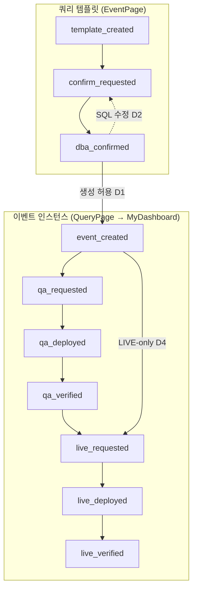

# 설계안: 쿼리 템플릿·이벤트 인스턴스 워크플로 분리

> **브랜치**: `feat/template-instance-workflow-split`  
> **상태**: 검토용 (Draft v1)  
> **작성 목적**: 템플릿 승인(컨펌)과 이벤트 실행(QA/LIVE) 프로세스를 분리하는 변경의 상세 설계·마이그레이션·영향 범위 정리

---

## 1. 배경·목표

### 1.1 현재 문제

- **쿼리 템플릿**(`IEventTemplate`): 상태 없음. CRUD만 존재 (`EventPage`, `POST/PUT /api/events`).
- **이벤트 인스턴스**(`IEventInstance`): 9단계 워크플로. **컨펌·DBA 컨펌이 인스턴스마다** 반복됨.

```
event_created → confirm_requested → dba_confirmed
  → qa_requested → qa_deployed → qa_verified
  → live_requested → live_deployed → live_verified
```

- 동일 템플릿으로 반복 이벤트를 만들 때, DBA가 **매 인스턴스마다** 컨펌해야 하는 부담.
- 템플릿 SQL 패턴과 인스턴스별 실행(입력값·반영일)의 **책임 경계**가 UI/상태 코드에 섞여 있음.

### 1.2 목표 (제안)

| 트랙 | 상태 흐름 |
|------|-----------|
| **쿼리 템플릿** | `template_created` → `confirm_requested` → `dba_confirmed` |
| **이벤트 인스턴스** | `event_created` → `qa_requested` → `qa_deployed` → `qa_verified` → `live_requested` → `live_deployed` → `live_verified` |

### 1.3 기대 효과

- DBA는 **템플릿 SQL 패턴을 1회** 검토·승인.
- GM/기획은 **승인된 템플릿**으로 이벤트를 반복 생성 → QA/LIVE만 진행.
- 나의 대시보드 스테퍼·알림 노이즈 감소 (인스턴스당 컨펌 2단계 제거).

### 1.4 비목표 (본 설계 범위 외)

- 역할/권한 체계 전면 개편 (단, 신규 템플릿 API는 **권한 기반**으로 통일 권장 — `docs/INVESTIGATION-ROLE-VS-EVENT-PROCESS.md` 참고).
- 쿼리 실행 엔진·DB 드라이버 변경.
- DEV DB 직접 실행 허용.

---

## 2. 핵심 설계 결정 (검토 필요)

아래는 **구현 전 PO/DBA/GM 합의**가 필요한 항목입니다.

| ID | 질문 | 권장안 | 대안 |
|----|------|--------|------|
| **D1** | `dba_confirmed` 템플릿만 이벤트 생성 허용? | **예** — `POST /api/event-instances` 및 QueryPage에서 차단 | 경고만 표시하고 생성 허용 |
| **D2** | 템플릿 `dba_confirmed` 후 SQL 수정 시 | **재승인 필수** — `confirm_requested`로 되돌림 | 버전 필드(`nTemplateVersion`) 도입 |
| **D3** | 인스턴스별 최종 SQL(`strGeneratedQuery`) DBA 검토 시점 | **유지**: `qa_requested` / `live_requested`에서 `my_dashboard.query_edit` | 템플릿 승인만으로 충분, 인스턴스 쿼리 수정 단계 제거 |
| **D4** | LIVE-only (`arrDeployScope: ['live']`) | **유지** — `event_created` → `live_requested` (QA 스킵) | LIVE-only도 QA 경유 |
| **D5** | 템플릿 생성 주체 | GM도 `event_template.create` 보유 시 템플릿 등록·승인 요청 | 관리자만 템플릿 CRUD |
| **D6** | 기존 템플릿 마이그레이션 | 일괄 `dba_confirmed` | `template_created` 후 수동 승인 |
| **D7** | 진행 중 인스턴스 (`confirm_requested` / `dba_confirmed`) | `event_created`로 매핑 (GM이 QA/LIVE 요청 재개) | `qa_requested`로 승격 |

**본 설계안 기본값**: D1=예, D2=재승인, D3=query_edit 유지, D4=LIVE 스킵 유지, D5=역할별, D6=일괄 승인, D7=`event_created`.

---

## 3. 상태 모델

### 3.1 쿼리 템플릿 (`TTemplateStatus`)

```typescript
export type TTemplateStatus =
  | 'template_created'    // 등록됨, 수정 가능
  | 'confirm_requested'   // 컨펌 요청됨, 본문 수정 제한(쿼리 포함)
  | 'dba_confirmed';      // DBA 승인 완료 — 이벤트 생성 허용
```

| 상태 | UI 라벨 | DEV/표시 환경 |
|------|---------|---------------|
| `template_created` | 템플릿 등록 | DEV |
| `confirm_requested` | 컨펌 요청 | DEV |
| `dba_confirmed` | DBA 승인 | — (사용 가능) |

#### 전이표 (템플릿)

| 현재 | 다음 | 액터(역할) | 필요 권한(권장) |
|------|------|-----------|-----------------|
| `template_created` | `confirm_requested` | game_manager, game_designer, admin | `event_template.request_confirm` |
| `confirm_requested` | `dba_confirmed` | dba, admin | `event_template.confirm` |
| `confirm_requested` | `template_created` | admin (거절/회수) | `event_template.edit` |
| `dba_confirmed` | `confirm_requested` | dba, admin (SQL 수정 후 재승인, D2) | `event_template.edit` + 재요청 |

> **수정 규칙 (D2)**  
> - `template_created`: `PUT /api/events/:id` — 기존 CRUD와 동일.  
> - `confirm_requested`: **쿼리·세트 수정 불가** (인스턴스 `confirm_requested`와 동일 정책).  
> - `dba_confirmed`: 본문 수정 시 **자동으로 `confirm_requested`** (또는 수정 API가 400 + “재승인 필요”).

#### 템플릿 처리자·이력 (신규)

인스턴스와 대칭 구조:

```typescript
interface ITemplateStageActor {
  strDisplayName: string;
  nUserId: number;
  strUserId: string;
  dtProcessedAt: string;
}

interface ITemplateStatusLog {
  strStatus: TTemplateStatus;
  strChangedBy: string;
  nChangedByUserId: number;
  strComment?: string;
  dtChangedAt: string;
}

interface IEventTemplate {
  // ... 기존 필드 ...
  strStatus: TTemplateStatus;
  arrStatusLogs: ITemplateStatusLog[];
  objCreator?: ITemplateStageActor | null;
  objConfirmer?: ITemplateStageActor | null;  // DBA 컨펌 처리자
}
```

---

### 3.2 이벤트 인스턴스 (`TEventStatus` — 변경 후)

```typescript
export type TEventStatus =
  | 'event_created'
  | 'qa_requested'
  | 'qa_deployed'
  | 'qa_verified'
  | 'live_requested'
  | 'live_deployed'
  | 'live_verified';
```

**제거**: `confirm_requested`, `dba_confirmed`

#### 전이표 (인스턴스)

| 현재 | 다음 | 액터 | 필요 권한 |
|------|------|------|-----------|
| `event_created` | `qa_requested` | GM/기획 | `my_dashboard.request_qa` |
| `event_created` | `live_requested` | GM/기획 | `my_dashboard.request_live` (LIVE-only, D4) |
| `qa_requested` | `qa_deployed` | DBA | `my_dashboard.execute_qa` (POST execute) |
| `qa_deployed` | `qa_verified` | GM/기획 | `my_dashboard.verify_qa` |
| `qa_deployed` | `qa_requested` | GM/기획 | `my_dashboard.request_qa_rereq` |
| `qa_verified` | `live_requested` | GM/기획 | `my_dashboard.request_live` |
| `qa_verified` | `qa_requested` | GM/기획 | 재요청 |
| `live_requested` | `live_deployed` | DBA | `my_dashboard.execute_live` |
| `live_deployed` | `live_verified` | GM/기획 | `my_dashboard.verify_live` |
| `live_deployed` | `live_requested` | GM/기획 | 재요청 |
| `live_verified` | `live_requested` | GM/기획 | 재요청 |

**`fnGetTransitions` 변경**: `dba_confirmed` 분기 삭제. `event_created`에서 `arrDeployScope`로 QA/LIVE 첫 요청 분기.

#### DBA 쿼리 수정 가능 상태 (D3)

| 변경 전 | 변경 후 |
|---------|---------|
| `confirm_requested`, `qa_requested`, `live_requested` | `qa_requested`, `live_requested` |

`event_created`에서는 생성자가 **일반 필드·쿼리 재생성** 가능 (기존과 동일).

#### `objConfirmer` (인스턴스)

- **제거 또는 deprecated** — DBA 컨펌은 템플릿 `objConfirmer`로 이전.
- 마이그레이션 시 JSON 필드는 유지해도 UI/API에서 미사용.

---

## 4. API 설계

### 4.1 신규·변경 API (템플릿)

| Method | Path | 설명 | 권한 |
|--------|------|------|------|
| `PATCH` | `/api/events/:id/status` | 템플릿 상태 전이 | 아래 표 |
| `GET` | `/api/events?strStatus=dba_confirmed` | 승인 템플릿 필터 (QueryPage) | `event_template.view` 등 기존 |
| (선택) | SSE `template_updated` | 템플릿 상태 변경 브로드캐스트 | 인증 |

**PATCH body 예시**

```json
{
  "strNextStatus": "confirm_requested",
  "strComment": "신규 아이템 지급 템플릿 컨펌 요청"
}
```

**상태별 PATCH 권한**

| strNextStatus | 권한 |
|---------------|------|
| `confirm_requested` | `event_template.request_confirm` |
| `dba_confirmed` | `event_template.confirm` |
| `template_created` (회수) | `event_template.edit` |

**`POST /api/events` 변경**

- 생성 시 `strStatus: 'template_created'`, `arrStatusLogs` 초기 행 추가.
- `objCreator` 기록.

**`PUT /api/events/:id` 변경**

- `dba_confirmed` + 본문(쿼리/세트) 변경 → D2에 따라 `confirm_requested` 자동 전이 또는 400.
- `confirm_requested` 중 쿼리 필드 변경 → 400.

### 4.2 변경 API (인스턴스)

| Method | Path | 변경 내용 |
|--------|------|-----------|
| `POST` | `/api/event-instances` | `nEventTemplateId`의 템플릿 `strStatus === 'dba_confirmed'` 검증 (D1) |
| `PATCH` | `/api/event-instances/:id/status` | `confirm_requested` / `dba_confirmed` 전이 제거 |
| `PUT` | `/api/event-instances/:id` | 쿼리 수정 허용 상태에서 `confirm_requested` 제거 |

### 4.3 게이트 검증 (인스턴스 생성)

```typescript
// eventInstanceController.fnCreateInstance — 의사코드
const objTemplate = arrEvents.find((e) => e.nId === nEventTemplateId);
if (!objTemplate || objTemplate.strStatus !== 'dba_confirmed') {
  res.status(400).json({
    bSuccess: false,
    strMessage: 'DBA 승인이 완료된 쿼리 템플릿만 이벤트를 생성할 수 있습니다.',
  });
  return;
}
```

---

## 5. 데이터 모델·DDL

### 5.1 MySQL `event_template` 컬럼 추가

```sql
ALTER TABLE event_template
  ADD COLUMN str_status VARCHAR(32) NOT NULL DEFAULT 'dba_confirmed'
    COMMENT 'template_created | confirm_requested | dba_confirmed'
    AFTER dt_created_at,
  ADD COLUMN arr_status_logs JSON NOT NULL DEFAULT ('[]')
    COMMENT 'ITemplateStatusLog[]'
    AFTER str_status,
  ADD COLUMN obj_creator JSON NULL COMMENT 'ITemplateStageActor'
    AFTER arr_status_logs,
  ADD COLUMN obj_confirmer JSON NULL COMMENT 'DBA ITemplateStageActor'
    AFTER obj_creator,
  ADD KEY idx_event_template_status (str_status);
```

> **기본값 `dba_confirmed`**: D6 — 기존 행은 마이그레이션 스크립트 없이도 이벤트 생성 가능.

### 5.2 JSON 모드 (`events.json`)

기존 템플릿 객체에 필드 추가:

```json
{
  "nId": 1,
  "strStatus": "dba_confirmed",
  "arrStatusLogs": [],
  "objCreator": null,
  "objConfirmer": null
}
```

`fnLoadJson` 시드·마이그레이션: 필드 없으면 `strStatus: 'dba_confirmed'` 보정.

### 5.3 `mysqlRelationalSync.ts`

- `fnRelationalLoadEvents` / write path에 `str_status`, `arr_status_logs`, `obj_creator`, `obj_confirmer` 매핑 추가.

### 5.4 인스턴스 `str_status` 값 정리

마이그레이션 SQL (MySQL):

```sql
-- D7: 진행 중 인스턴스를 event_created로 (GM이 QA/LIVE 요청 재개)
UPDATE event_instance
SET str_status = 'event_created'
WHERE str_status IN ('confirm_requested', 'dba_confirmed');

-- 이력 JSON(arr_status_logs)은 별도 Node 스크립트로 append 권장:
-- "워크플로 분리 마이그레이션: confirm/dba_confirmed → event_created"
```

---

## 6. 권한 (`TPermission`)

### 6.1 신규 권한 (backend + front types 동기화)

| 권한 | 라벨 | 용도 |
|------|------|------|
| `event_template.request_confirm` | 템플릿 컨펌 요청 | template_created → confirm_requested |
| `event_template.confirm` | 템플릿 DBA 승인 | confirm_requested → dba_confirmed |

### 6.2 역할 시드 매핑 (초안)

| 역할 | 추가 권한 |
|------|-----------|
| admin | 둘 다 + 기존 `event_template.manage` |
| dba | `event_template.confirm`, `event_template.view` |
| game_manager | `event_template.request_confirm`, `event_template.create`(D5), `event_template.view` |
| game_designer | GM과 동일 또는 view+request_confirm만 |

### 6.3 레거시 권한

| 기존 | 처리 |
|------|------|
| `my_dashboard.request_confirm` | 인스턴스에서 **미사용** (deprecated 표시, `OBJ_EXPAND`에서 제거 검토) |
| `my_dashboard.confirm` | 인스턴스에서 **미사용** → `event_template.confirm`으로 UI 이동 |

> PATCH status 검사는 **권한만** 사용 (역할 `arrAllowedRoles`는 문서용·이중검증 optional). `docs/INVESTIGATION-ROLE-VS-EVENT-PROCESS.md` 이슈 재발 방지.

---

## 7. 프론트엔드

### 7.1 EventPage (쿼리 템플릿)

- 목록에 **상태 Tag** (`template_created` / `confirm_requested` / `dba_confirmed`).
- 행 액션: **컨펌 요청**, **DBA 승인** (권한별 표시/숨김).
- 상세/수정: 상태별 필드 잠금 (§3.1).
- (선택) 템플릿 진행 **Steps** 컴ponent — 3단계.

### 7.2 QueryPage

- 템플릿 Select: **`strStatus === 'dba_confirmed'`만** 노출 (D1).
- 미승인 템플릿 안내: “Event 메뉴에서 DBA 승인 후 사용 가능”.

### 7.3 MyDashboardPage

- `fnBuildSteps`: 앞 2단계(컨펌·DBA 컨펌) **제거** → 6~7단계 (LIVE-only 시 QA 3단계 생략).
- `fnRenderActions`: `event_created`에서 **QA/LIVE 요청** 버튼 (기존 `dba_confirmed` 블록 이동).
- `OBJ_STATUS_CONFIG`: 2개 상태 삭제 + 타입 정리.

### 7.4 DashboardPage

- 상태 카드: `confirm_requested`, `dba_confirmed` **제거**.
- (선택) 템플릿 대기 건수 위젯 — `confirm_requested` 템플릿 수.

### 7.5 알림·SSE

| 이벤트 | 채널 | 비고 |
|--------|------|------|
| 템플릿 상태 변경 | SSE `template_updated` (신규) 또는 EventPage 폴링 | 1순위: DBA에게 `confirm_requested` |
| 인스턴스 상태 변경 | 기존 `instance_updated` | `confirm_requested` 알림 규칙 삭제 |

`eventInstanceNotificationEligibility.ts` — `confirm_requested`/`dba_confirmed` 분기 제거.  
신규 `eventTemplateNotificationEligibility.ts` — DBA/요청자 eligibility.

---

## 8. 마이그레이션·롤아웃 (3단계)

### Phase 1 — 템플릿 워크플로 추가 (호환)

- 템플릿 status 필드·API·EventPage UI.
- 인스턴스 9단계 **유지** (병행).
- QueryPage: 승인 템플릿 우선 표시, 미승인은 경고만.

**완료 기준**: 템플릿 CRUD → 컨펌 요청 → DBA 승인 E2E.

### Phase 2 — 인스턴스 생성 게이트

- `POST /api/event-instances`에서 `dba_confirmed` 필수 (D1).
- QueryPage: 미승인 템플릿 선택 불가.

**완료 기준**: 미승인 템플릿으로 생성 시 400.

### Phase 3 — 인스턴스 2단계 제거

- `TEventStatus`에서 2状态 삭제, 전이·UI·테스트·마이그레이션 SQL 실행 (§5.4).
- deprecated 권한 정리.

**완료 기준**: E2E workflow spec 갱신, 기존 API 테스트 green.

### 롤백

- Phase 3 전: 인스턴스 confirm 단계 코드 유지로 즉시 롤백 가능.
- Phase 3 후: DB `str_status` 백업 + 코드 revert 필요.

---

## 9. 테스트 계획

| 영역 | 케이스 |
|------|--------|
| API | 템플릿 전이 권한 403/200, 미승인 템플릿으로 인스턴스 생성 400 |
| API | 인스턴스 `event_created` → qa/live 요청, LIVE-only 스킵 |
| API | `qa_requested`/`live_requested` query_edit 유지 |
| API | 템플릿 `dba_confirmed` 후 SQL 수정 → 재승인 (D2) |
| E2E | `workflow-qa-live.spec.ts` — 템플릿 승인 선행 단계 추가 |
| E2E | `navigation-gm01`, `my-dashboard-dba` — 버튼 노출 |
| Migration | confirm_requested 인스턴스 → event_created 후 GM QA 요청 가능 |

---

## 10. 영향 파일 (체크리스트)

### Backend

- [ ] `backend/src/data/events.ts` — `TTemplateStatus`, interface 확장
- [ ] `backend/src/controllers/eventController.ts` — status PATCH, PUT 게이트
- [ ] `backend/src/controllers/eventInstanceController.ts` — 전이表, create 게이트, query_edit 상태
- [ ] `backend/src/data/eventInstances.ts` — `TEventStatus` 축소
- [ ] `backend/src/db/mysqlAppSchema.ts` — DDL
- [ ] `backend/src/db/mysqlRelationalSync.ts` — load/write
- [ ] `backend/src/types/index.ts` + `front/src/types/index.ts` — 권한
- [ ] `backend/src/data/roles.ts` — `OBJ_EXPAND`
- [ ] `backend/src/services/eventInstanceNotificationEligibility.ts`
- [ ] (신규) `eventTemplateNotificationEligibility.ts`
- [ ] `backend/src/services/sseBroadcaster.ts` — template SSE
- [ ] `backend/src/__tests__/api.test.ts`, E2E seed scripts

### Frontend

- [ ] `front/src/pages/EventPage.tsx`
- [ ] `front/src/pages/QueryPage.tsx`
- [ ] `front/src/pages/MyDashboardPage.tsx`
- [ ] `front/src/pages/DashboardPage.tsx`
- [ ] `front/src/types/index.ts` — `OBJ_STATUS_CONFIG`, `fnGetDisplayEnv`
- [ ] `front/e2e/workflow-qa-live.spec.ts`, `HEADED-TEST-CATALOG.md`

### Docs / Rules

- [ ] `.cursor/rules/domain-event-instance.mdc`
- [ ] `CLAUDE.md`, `SKILL.md` — 9단계 → 분리 설명
- [ ] `docs/PERMISSION-MENU-ACTION-MATRIX.md`

---

## 11. 리스크·완화

| 리스크 | 영향 | 완화 |
|--------|------|------|
| 인스턴스별 잘못된 입력값 | QA 실행 실패/오데이터 | D3 query_edit 유지, QueryPage 입력 검증 강화 |
| 템플릿 승인 후 SQL 변경 | 기존 이벤트와 불일치 | D2 재승인 + (선택) `nTemplateVersion` on instance |
| Phase 3 중 진행 건 | 중간 상태 유실 | D7 매핑 + 배포 전 상태 스냅샷 |
| 권한·역할 불일치 | 403 / 버튼만 보임 | 신규 API는 permission-only (`INVESTIGATION` 문서 반영) |
| MySQL·JSON 듀얼 모드 | flush 누락 | 템플릿 CUD 후 `fnAwaitMysqlDocFlush` |

---

## 12. 오픈 이슈 (검토 회의 안건)

1. **D5** GM에게 `event_template.create` 부여 여부 (템플릿 self-service).
2. **D2** 재승인 vs 버전 관리 — 장기적으로 `event_template_revision` 테이블 필요 여부.
3. **Slack/WebPush** 템플릿 알림 채널 분리 (`SLACK_DBA_NOTIFY_STATUSES` 확장).
4. **스텁 템플릿** (`import-json-to-mysql`, FK용): 항상 `dba_confirmed`로 import?
5. **완료된 템플릿 비활성화** (`bIsActive`?) — 승인 후 사용 중단 시나리오.

---

## 13. 요약

| 항목 | 내용 |
|------|------|
| **가능 여부** | ✅ 기술·도메인 모두 가능 |
| **권장 롤아웃** | 3 Phase (템플릿 추가 → 게이트 → 인스턴스 축소) |
| **핵심 게이트** | `dba_confirmed` 템플릿만 `POST /api/event-instances` |
| **인스턴스 단축** | 9단계 → 6~7단계 (LIVE-only 시 QA 생략) |
| **DB 변경** | `event_template` 4컬럼 + 인스턴스 status UPDATE |
| **신규 권한** | `event_template.request_confirm`, `event_template.confirm` |

---

## 부록 A — 변경 후 전체 다이어그램



---

*Draft v1 — 검토 코멘트는 본 문서 또는 이슈/PR에 남겨 주세요.*
