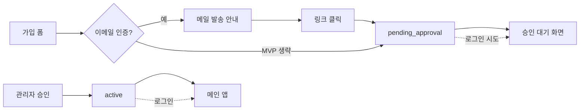

# 회원 가입 · 이메일 인증 · 관리자 승인 — UI 설계

> DQPM 기존 패턴 기준: `LoginPage` 카드 레이아웃, Ant Design, `AppTable`, 권한 기반 버튼 노출.  
> 구현 전 화면·라우트·상태·카피 확정용 문서.

---

## 1. 설계 원칙

| 원칙 | 적용 |
|------|------|
| **인증 화면 일관성** | 로그인·가입·인증·대기는 동일 **420px 카드 + 그라데이션 배경** (`LoginPage` 재사용) |
| **공개 vs 관리 분리** | 가입·인증은 `PublicRoute` (비로그인). 승인은 **사용자 메뉴** 확장 |
| **상태가 보이게** | 사용자·관리자 모두 **Tag + Steps**로 지금 어디인지 표시 |
| **최소 권한** | 승인 전 **로그인 자체 차단** (403 `pending_approval`) |
| **기존 UserPage 활용** | “즉시 생성” 모달 유지 + **승인 대기** 탭·일괄 승인 |

---

## 2. 화면 목록 & 라우트

| # | 경로 | 페이지명 | 접근 |
|---|------|----------|------|
| 0 | `/login` | 로그인 (기존) | 공개 |
| 1 | `/register` | 회원 가입 | 공개 |
| 2 | `/register/sent` | 가입 완료 · 메일 안내 | 공개 |
| 3 | `/verify-email` | 이메일 인증 처리 (`?token=`) | 공개 |
| 4 | `/users` | 사용자 (기존 확장) | `user.view` + 승인 탭은 `user.approve` |

```text
[비로그인]
  /login ←→ /register → /register/sent
                ↓ (메일 링크)
            /verify-email → (성공) /login 또는 /pending-approval

[로그인, status=pending_approval]
  /pending-approval  (MainLayout 없음 또는 최소 헤더만)

[관리자]
  /users?tab=pending  → 승인 모달
```

---

## 3. 공통 레이아웃 — `AuthCardLayout` (신규 컴포넌트)

`LoginPage`에서 카드·배경만 분리해 재사용.

```text
┌─────────────────────────────────────────────┐
│           (그라데이션 full viewport)          │
│              ┌───────────────────┐          │
│              │  [DB 아이콘 48px]  │          │
│              │  DQPM (Title h3)   │          │
│              │  부제 (Text sec.)   │          │
│              │  ───────────────   │          │
│              │  { children }      │          │
│              │  ───────────────   │          │
│              │  하단 링크 영역     │          │
│              └───────────────────┘          │
│                    width: 420               │
└─────────────────────────────────────────────┘
```

**Props 예시**

- `strTitle`, `strSubtitle`
- `children` — Form / Result / Steps
- `strFooterLinkLabel`, `strFooterLinkTo` — “로그인으로 돌아가기” 등

---

## 4. 화면별 와이어프레임

### 4.1 로그인 (`/login`) — 변경만

기존 카드 하단에 링크 추가:

```text
┌──────────────────────────────┐
│  … 아이디 / 비밀번호 …        │
│  [        로그인        ]     │
│                              │
│  계정이 없으신가요? 회원 가입  │  ← Link → /register
└──────────────────────────────┘
```

**로그인 실패 분기 (추가 메시지)**

| 서버 코드 | UI |
|-----------|-----|
| `pending_email` | Alert: “이메일 인증을 완료해 주세요.” + [인증 메일 재발송] |
| `pending_approval` | Alert: “관리자 승인 대기 중입니다.” + Link → `/pending-approval` |
| `rejected` | Alert: “가입이 거절되었습니다. 관리자에게 문의하세요.” |

---

### 4.2 회원 가입 (`/register`)

```text
┌──────────────────────────────┐
│  회원 가입                    │
│  사내 DQPM 사용 신청입니다.    │
│                              │
│  아이디 *     [____________]  │
│  (영문·숫자만 4~32, 중복확인)  │  ← 입력 시 비영숫자 제거, blur 중복 API
│                              │
│  이메일 *     [____________]  │
│  (@masangsoft.com 권장 문구)   │  ← 선택: 도메인 whitelist 안내
│                              │
│  이름 *       [____________]  │
│                              │
│  비밀번호 *   [____________]  │
│  비밀번호 확인 [____________]  │
│                              │
│  [ ] 이용 안내에 동의 (필수)   │
│                              │
│  [      가입 신청      ]      │
│                              │
│  이미 계정이 있나요? 로그인    │
└──────────────────────────────┘
```

**필드 검증 (UI 즉시 피드백)**

| 필드 | 규칙 |
|------|------|
| 아이디 | required, pattern, 중복 API |
| 이메일 | required, email format |
| 비밀번호 | min 8, 대소문자·숫자·특수 2종 (정책은 팀 합의) |
| 확인 | `dependencies` 일치 |

**제출 성공** → `/register/sent?email=masked`

---

### 4.3 가입 완료 · 메일 안내 (`/register/sent`)

```text
┌──────────────────────────────┐
│  ✉ (MailOutlined 큰 아이콘)   │
│  인증 메일을 보냈습니다         │
│                              │
│  ***@masangsoft.com 으로       │
│  인증 링크를 발송했습니다.      │
│                              │
│  메일함을 확인하고 24시간 내    │
│  링크를 클릭해 주세요.          │
│                              │
│  [ 인증 메일 다시 보내기 ]      │  ← email query 또는 session
│                              │
│  로그인으로 돌아가기           │
└──────────────────────────────┘
```

**2단계 MVP (이메일 없음)**  
이 화면 생략 → 가입 성공 시 바로 Result “관리자 승인 대기” + `/login` 링크.

---

### 4.4 이메일 인증 (`/verify-email?token=...`)

토큰 검증 중·결과만 표시 (폼 없음).

```text
[로딩]  Spin + “인증 확인 중…”

[성공]
┌──────────────────────────────┐
│  Result status="success"      │
│  이메일 인증이 완료되었습니다   │
│  관리자 승인 후 이용 가능합니다 │
│  [ 로그인 ]                   │
└──────────────────────────────┘

[실패/만료]
┌──────────────────────────────┐
│  Result status="error"        │
│  링크가 만료되었거나 유효하지   │
│  않습니다.                    │
│  [ 인증 메일 다시 요청 ]       │  → /register/resend
└──────────────────────────────┘
```

---

### 4.5 승인 대기 (`/pending-approval`)

로그인은 되었으나 `strStatus !== active` → `ProtectedRoute` 대신 이 페이지로.

```text
┌──────────────────────────────┐
│  (최소 헤더: DQPM + 로그아웃)   │  ← MainLayout 사이드바 없음
│                              │
│  ClockCircleOutlined          │
│  관리자 승인을 기다리는 중      │
│                              │
│  Steps (현재 2단계 강조)       │
│  ① 가입  ② 이메일 인증 ✓       │
│  ③ 관리자 승인 (진행 중)        │
│                              │
│  신청일: 2026-05-21           │
│  아이디: hglee                │
│                              │
│  승인되면 이메일 또는 이 화면에서 │
│  자동으로 이동합니다.          │
│                              │
│  [ 로그아웃 ]                 │
└──────────────────────────────┘
```

**선택**: SSE/폴링으로 `active` 되면 `navigate('/my-dashboard')`.

---

## 5. 관리자 — 사용자 페이지 확장 (`/users`)

### 5.1 상단 탭 (Segmented 또는 Tabs)

```text
┌─────────────────────────────────────────────────────────┐
│  사용자 관리                              [+ 사용자 추가] │
│                                                         │
│  [ 전체 42 ] [ 승인 대기 3 ] [ 이메일 미인증 1 ]          │  ← Badge count
│  ─────────────────────────────────────────────────────  │
│  (필터: 아이디/이름 검색 Input)                           │
│                                                         │
│  AppTable …                                             │
└─────────────────────────────────────────────────────────┘
```

| 탭 | 데이터 | 관리 컬럼 |
|----|--------|-----------|
| 전체 | `active` + 기존 | 수정 / 비밀번호 / 삭제 (기존) |
| 승인 대기 | `pending_approval` | **승인** / **거절** |
| 이메일 미인증 | `pending_email` | (읽기 전용) 재발송은 사용자 측 |

### 5.2 상태 컬럼 (전체 탭에도 표시)

```text
| 상태        | Tag 색상   |
|-------------|-----------|
| active      | green     |
| pending_approval | gold |
| pending_email    | blue  |
| rejected    | red       |
| disabled    | default   |
```

### 5.3 승인 모달 (`ApproveUserModal`)

기존 “사용자 추가” 모달과 **동일 폼의 역할 Select** 재사용.

```text
┌──────── 승인 ────────┐
│  hglee (이형근)        │
│  hglee@masangsoft.com  │
│  가입일: … / 인증: ✓   │
│                      │
│  부여할 역할 * (multi) │
│  [ game_designer ▼ ]   │
│                      │
│  (선택) 메모           │
│  [________________]    │
│                      │
│  [ 취소 ]  [ 승인 ]    │
└──────────────────────┘
```

**거절** → `Popconfirm` + 선택 사유 → status `rejected`.

### 5.4 헤더 알림 (선택)

`MainLayout` 사용자 메뉴 옆 Badge: `nPendingApprovalCount`  
→ 클릭 시 `/users?tab=pending`

권한: `user.approve` 보유자만.

---

## 6. 사용자 여정 (Mermaid)



---

## 7. 컴포넌트·파일 계획 (구현 시)

| 파일 | 역할 |
|------|------|
| `components/AuthCardLayout.tsx` | 인증 카드 공통 |
| `pages/RegisterPage.tsx` | 가입 |
| `pages/RegisterSentPage.tsx` | 메일 안내 |
| `pages/VerifyEmailPage.tsx` | 토큰 처리 |
| `pages/PendingApprovalPage.tsx` | 승인 대기 |
| `components/ApproveUserModal.tsx` | 승인·역할 |
| `pages/UserPage.tsx` | 탭·승인/거절 컬럼 확장 |
| `api/authRegisterApi.ts` | register, verify, resend |
| `App.tsx` | PublicRoute 라우트 추가 |

---

## 8. 단계별 UI 범위

### Phase A — UI 목업만 (이메일 없음)

- `/register`, `/pending-approval`
- `/login` 하단 링크 + 상태별 Alert
- `/users` **승인 대기** 탭 + 승인 모달
- 이메일 컬럼·탭은 숨기거나 “—”

### Phase B — 이메일 인증 UI

- `/register/sent`, `/verify-email`
- **이메일 미인증** 탭
- 로그인 `pending_email` 분기

### Phase C — polish

- 아이디 중복 실시간, 비밀번호 강도 Progress
- 관리자 pending Badge, 승인 시 Web Push/인앱 알림

---

## 9. 카피 초안 (한글)

| 위치 | 문구 |
|------|------|
| 가입 부제 | DQPM 계정을 신청합니다. 승인 후 DB 이벤트 업무에 참여할 수 있습니다. |
| 가입 버튼 | 가입 신청 |
| 승인 대기 | 관리자가 역할을 부여하면 알림 없이도 로그인 시 자동 이동됩니다. |
| 승인 모달 제목 | 가입 승인 |
| 거절 확인 | 이 사용자의 가입을 거절할까요? 되돌리려면 관리자가 다시 승인해야 합니다. |

---

## 10. UX 결정 (확정 — 2026-05)

- [x] **이메일 필수** — Phase A부터 필수, Phase B에서 링크 인증 추가
- [x] **이메일 도메인** — `@masangsoft.com` only (UI·서버)
- [x] **승인 전 로그인** — **로그인 단계에서 차단** (`pending_approval` → 403). GUEST 임시 이용·`/pending-approval` 페이지 **미사용**
- [ ] **거절 후 재가입** — 미정 (현재 동일 아이디 행 유지 → 재가입 불가)
- [x] **관리자 사용자 추가** — 즉시 `active`, 이메일 선택 입력
- [x] **아이디 입력** — 영문·숫자만 4~32자 (밑줄 제외)

---

## 11. 구현 현황

| 단계 | 내용 | 상태 |
|------|------|------|
| 1 | 체크리스트 확정 | ✅ |
| 2 | Phase A UI (`AuthCardLayout`, `/register`, `/register/sent`, `/login` 링크, `/users` 승인 탭) | ✅ |
| 3 | API 스펙 `docs/USER-REGISTRATION-API.md` | ✅ |

### Phase A — 완료

- `/register`, `/register/sent`, `/login` 회원 가입 링크
- 아이디·이메일 중복 확인 (`GET /auth/check-register`)
- 이메일 `@masangsoft.com` 자동 접미
- 승인 대기 로그인 차단, 거절·승인 API
- `user.approve`, `guest` 역할, MySQL `str_email` / `str_status`

### 남은 작업

| 우선 | 항목 | 비고 |
|------|------|------|
| 높음 | MySQL `guest` 역할·`user.approve` 권한 동기화 | JSON에는 있으나 DB에 없을 수 있음 |
| 높음 | 기존 사용자 `str_email` / `str_status` 수동·스크립트 반영 | 운영 데이터 |
| 중간 | 거절 계정 삭제 또는 재가입 정책 | 제품 결정 후 |
| 중간 | `USER-REGISTRATION-UI.md` 와이어프레임 §4.1~4.4 현행화 | `/pending-approval` 제거 반영 |
| ~~낮음~~ | ~~`PendingApprovalBanner.tsx`~~ | 삭제 완료 |
| Phase B | `/verify-email`, `pending_email`, 인증 메일 재발송 | SMTP |
| Phase C | 비밀번호 강도, 승인 Web Push, Rules/Skills 동기화 | polish |
