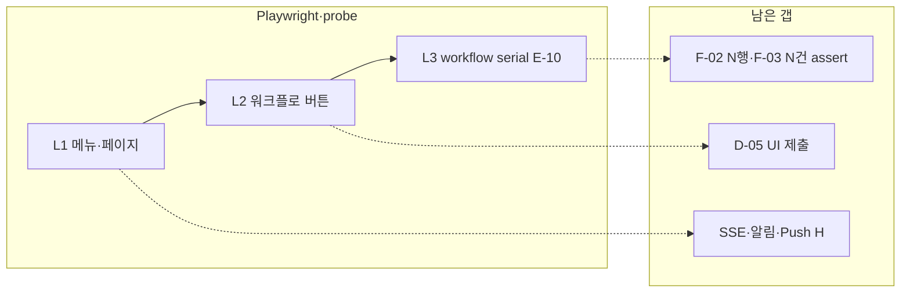

# DQPM Headed E2E 테스트 카탈로그

> **페이지별 통합 계획(SSOT)**: [docs/E2E-PAGE-TEST-PLAN.md](../../docs/E2E-PAGE-TEST-PLAN.md) — 기능 추가 시 매트릭스 한 줄 먼저 갱신.  
> 본 파일은 **카탈로그 ID·풀 번호·probe 명령** 부록이다.

**하이브리드 운영**: Playwright **자동 검증** + 본 문서 **수동 체크리스트**를 함께 씁니다.

| 모드 | 표기 | 의미 |
|------|------|------|
| 자동 | 🤖 `@automate` | `npm run test:e2e` / `test:e2e:smoke` — CI·배포 전 |
| 수동 | 📋 `@manual` | 카탈로그만 — UI 모드로 눈으로 확인 (`test:e2e:ui` + 아래 §I) |
| 둘 다 | 🔀 | 자동 smoke + 배포 전 사람이 풀 플로우 한 번 |

레거시 표기: ✅ Playwright · 🔶 probe · ⬜ 미구현

**기능 추가/수정 시**: Cursor 규칙 `browser-e2e-smoke` — 에이전트가 작업 마무리 전 **헤드리스 smoke** 자동 실행. headed는 사용자가 «브라우저 띄워» 등으로 요청할 때만.

### 빠른 실행

```powershell
cd front
npm run test:e2e:smoke              # @smoke만 (~1분)
npm run test:e2e:smoke:headed       # smoke + 브라우저 창
npm run test:e2e:workflow           # QA 실행 모달 등 (@workflow)
npm run test:e2e:ui                 # 전체 — 수동 체크리스트 따라가기
```

| spec 파일 | 담당 ID |
|-----------|---------|
| `auth.spec.ts`, `navigation.spec.ts`, `products.spec.ts` | A-01~04, B-01~07, C-01 |
| `register-page.spec.ts` | A-05 |
| `register-approve.spec.ts` | A-05~09 🤖 |
| `my-dashboard-dba.spec.ts` | B-07, E-X1, F-04 🔀 |
| `navigation-gm01.spec.ts` | B-gm01, B-07, B-08 🤖 |
| `workflow-qa-live.spec.ts` | E-02, E-D1, E-05~E-10 serial 🤖 `@workflow` |
| `workflow-pool-live-delete.spec.ts` | 풀 #152~162 LIVE·삭제 🤖 `@pool` · 체크리스트 **§P** |
| `result-ui.spec.ts` | F-02, F-03 🤖 `@result-ui` |
| `scripts/probe-gm01-headed-full.mjs` | gm01 L1 투어 |
| `scripts/probe-gm01-dba01-headed-full.mjs` | gm01+dba01 L2~L3 (§I + `DQPM_FRESH`) |
| `scripts/probe-*.mjs` (기타) | F-01~F-04 headed 데모 |

---

## 공통 실행 방법

### 서버

```powershell
# 프로젝트 루트 — 서버 자동 기동 후 e2e
.\scripts\run-e2e-with-servers.ps1

# 또는 수동
cd backend; npm run dev    # :4000
cd front; npm run dev      # :5173
```

### Headed (창 보기)

```powershell
cd front
npx playwright test e2e/auth.spec.ts --headed
npm run test:e2e:ui          # UI 모드 — 단계별 재생·일시정지
```

### Probe 스크립트 (나의 대시보드 QA 실행 등)

```powershell
cd front
$env:DQPM_HEADED = '1'
$env:DQPM_SLOW_MO = '400'
$env:DQPM_BASE = 'http://112.185.196.8:5173'   # 원격이면 설정
$env:DQPM_USER = 'dba01'
$env:DQPM_PASS = 'dba01'
node scripts/probe-select-result-ui.mjs
```

### 환경 변수 (계정)

| 변수 | 용도 |
|------|------|
| `E2E_USER_ID` / `E2E_PASSWORD` | Playwright **관리자** (승인·메뉴) |
| `E2E_DBA_USER_ID` / `E2E_DBA_PASSWORD` | Playwright **DBA** (기본 `dba01`) |
| `DQPM_USER` / `DQPM_PASS` | probe 스크립트 |
| `PLAYWRIGHT_BASE_URL` | 기본 `http://127.0.0.1:5173` |

---

## 권장 테스트 계정 (역할별)

| 역할 | 용도 | 예시 (환경에 맞게 교체) |
|------|------|-------------------------|
| **신규 가입용** | 회원가입·승인 대기 | 매번 새 `testuser001` |
| **admin** | 승인·사용자·역할·전체 메뉴 | `admin` / 시드 비밀번호 |
| **dba01** | 템플릿 승인(EventPage)·QA/LIVE 실행·쿼리 수정 | `dba01` |
| **GM/기획** | 이벤트 생성·수정·확인 요청 | 제품별 담당 계정 |
| **guest** | 승인 전 — 로그인 불가 확인 | 가입 직후 |

> 한 번에 **회원가입 → LIVE 확인**까지 보려면 계정을 바꿔 가며 2~4명이 필요합니다.

---

## A. 인증·회원가입

| ID | 시나리오 | 페이지 | 계정 | 기대 결과 | 자동화 |
|----|----------|--------|------|-----------|--------|
| A-01 | 로그인 화면 요소 표시 | `/login` | — | 아이디·비밀번호·로그인·회원가입 링크 | ✅ `auth.spec` |
| A-02 | 올바른 계정 로그인 | `/login` | admin 또는 dba01 | `/login` 이탈, 레이아웃 표시 | ✅ `auth.spec` |
| A-03 | 잘못된 비밀번호 | `/login` | dba01 + 틀린 PW | 오류 토스트 | ✅ `auth.spec` |
| A-04 | 로그아웃 | 헤더 | 로그인 후 | `/login` 복귀 | ✅ `auth.spec` |
| A-05 | 회원가입 폼 표시 | `/register` | — | 사내 이메일·약관·중복검사 UI | 🤖 `register-page` |
| A-06 | 아이디 중복 검사 | `/register` | — | 사용 가능/불가 표시 | 🤖 `register-approve` |
| A-07 | 가입 제출 성공 | `/register` | 신규 ID | 완료 안내, 로그인 이동 링크 | 🤖 `register-approve` |
| A-08 | 승인 대기 로그인 차단 | `/login` | 방금 가입 계정 | 403·승인 대기 메시지 | 🤖 `register-approve` |
| A-09 | 관리자 승인 | `/users` 승인 대기 탭 | admin | `active`, 역할 부여 | 🤖 `register-approve` |
| A-10 | 관리자 거절 | `/users` | admin | `rejected`, 재로그인 차단 | ⬜ |
| A-11 | 거절 후 재가입 | `/register` | 동일 ID | `pending_approval` 복구 | ⬜ |

---

## B. 메뉴·페이지 진입 (권한별 노출)

| ID | 메뉴 | 경로 | 권한(요약) | 자동화 |
|----|------|------|------------|--------|
| B-01 | 대시보드 | `/` | `dashboard.view` | ✅ `navigation.spec` |
| B-02 | 프로덕트 | `/products` | `product.view` | ✅ |
| B-03 | 쿼리 템플릿 | `/events` | `event_template.view` | ✅ |
| B-04 | DB 접속 정보 | `/db-connections` | `db_connection.view` | ✅ |
| B-05 | 사용자 | `/users` | `user.view` | ✅ |
| B-06 | 역할 권한 | `/roles` | `role.view` | ✅ |
| B-07 | 나의 대시보드 | `/my-dashboard` | `my_dashboard.view` | ✅ |
| B-08 | 이벤트 생성 | `/query` | `query.create` 등 | 🤖 `navigation-gm01` |
| B-09 | 활동 | `/activity` | `activity.view` | ⬜ |
| B-10 | 권한 없는 메뉴 숨김 | 사이드바 | guest/제한 역할 | 해당 항목 미노출 | ⬜ |

---

## C. 마스터 데이터 (관리 화면)

| ID | 시나리오 | 페이지 | 계정 | Headed 포인트 | 자동화 |
|----|----------|--------|------|---------------|--------|
| C-01 | 프로덕트 목록·추가 모달 | `/products` | admin | 추가 → 등록 모달 → 취소 | ✅ `products.spec` |
| C-02 | 프로덕트 등록 저장 | `/products` | admin | MSSQL/MySQL 타입 선택 | ⬜ |
| C-03 | DB 접속 목록 | `/db-connections` | dba/admin | QA/LIVE 탭·종류 필터 | ⬜ |
| C-04 | DB 접속 등록 | `/db-connections` | dba | 연결 테스트 → 저장 | ⬜ |
| C-05 | DB 접속 연결 테스트 실패/성공 | 모달 | dba | 토스트·메시지 | ⬜ |
| C-06 | 쿼리 템플릿 목록 | `/events` | GM/admin | 필터·상세 링크 | ⬜ |
| C-07 | 쿼리 템플릿 CRUD | `/events` | `event_template.manage` | 생성·수정·삭제(참조 시 차단) | ⬜ |
| C-08 | 역할 권한 편집 | `/roles` | admin | raw 권한 체크박스 | ⬜ |
| C-09 | 사용자 목록·접속 표시 | `/users` | admin | 온라인 점·presence | ⬜ |
| C-10 | 대시보드 카드 DnD/리사이즈 | `/` | admin | 위젯 이동·저장 | ⬜ |

---

## D. 이벤트 생성 (`/query`)

| ID | 시나리오 | 담당 | 기대 | 자동화 |
|----|----------|------|------|--------|
| D-01 | 템플릿 선택·입력값·미리보기 | GM | 쿼리 미리보기 갱신 | ⬜ |
| D-02 | 반영 범위 QA+LIVE | GM | `arrDeployScope` both | ⬜ |
| D-03 | 반영 범위 LIVE만 | GM | QA 단계 스킵 워크플로 | ⬜ |
| D-04 | 다중 쿼리 세트 생성 | GM | `arrExecutionTargets` N개 | ⬜ |
| D-05 | 제출 → `event_created` | GM | 나의 대시보드에 행 생성 | 🤖 seed+`workflow` / probe `DQPM_FRESH` |
| D-06 | DEV 환경 이벤트 생성 | GM | DEV 태그·템플릿 리뷰 플로우 | ⬜ |

---

## T. 템플릿 워크플로 (EventPage — 인스턴스 이전)

| ID | 단계 | 상태 | 담당 | 비고 |
|----|------|------|------|------|
| T-01 | 쿼리 리뷰 요청 | `confirm_requested` | GM `event_template.request_confirm` | 🤖 시드 자동 |
| T-02 | DBA 리뷰 완료 | `dba_confirmed` | DBA `event_template.confirm` | 🤖 시드 자동 · D1 생성 허용 |

---

## E. 7단계 인스턴스 워크플로 (핵심 — QA+LIVE 경로)

### E2E 대상 이벤트 제한 (필수)

| 규칙 | 내용 |
|------|------|
| **생성자** | `gm01` · `dba01` · `gm02` 만 (`nCreatedByUserId` 검증, `helpers/e2eCreators.ts`) |
| **제외** | 그 외 사용자·운영 데이터(#33 등) — workflow/probe/result-ui에서 skip·throw |
| **풀 번호** | `E2E_INSTANCE_POOL=152-162` (기본) — LIVE·삭제 이어하기 |
| **고정 ID** | `E2E_INSTANCE_ID` / `DQPM_WORKFLOW_ID` — 풀·생성자 검증 후 사용 |

### 운영 원칙 (풀 #152~162)

- **일괄 자동 실행하지 않음** — 사용자 지시(예: «#158 headed, 삭제 제외») 후에만 해당 행 실행.
- **생성자** `gm01` / `dba01` / `gm02` 만 (`e2eCreators.ts`).
- **단건 고정**: `E2E_INSTANCE_ID=<번호>` + 아래 P-POOL 표의 spec/명령.

### 「삭제 제외」의 의미 (풀·headed 공통)

**끝까지 가는 범위** = **T-01~T-02**(템플릿, 시드 자동) + **7단계(E-01~E-02·E-D1·E-05~E-10)**. **포함하지 않음**: 숨기기(E-X2), **삭제(E-X3)**.

| 순서 | 업무 표현 (DQPM) | E-ID | 상태(도달) | 담당 |
|------|------------------|------|------------|------|
| 0 | **템플릿 DBA 승인** | T-01~T-02 | `dba_confirmed` | GM→DBA (EventPage) |
| 1 | **이벤트 생성** | E-01 | `event_created` | GM |
| 2 | **QA 반영 요청** | E-05 | `qa_requested` | GM |
| 3 | **QA 반영 실행** | E-06 | `qa_deployed` | DBA |
| 4 | **QA 확인** | E-07 | `qa_verified` | GM |
| 5 | **LIVE 반영 요청** | E-08 | `live_requested` | GM |
| 6 | **LIVE 반영 실행** | E-09 | `live_deployed` | DBA |
| 7 | **완료** (LIVE 확인) | E-10 | `live_verified` | GM |

- (선택) E-02 수정 · E-D1 DBA 쿼리 수정 — 본 7단계에 **끼워 넣는 부가** 단계.
- 인스턴스가 **이미 중간 상태**면, 위 표에서 **현재 다음 단계부터 E-10**까지 진행 (예: `qa_requested`면 E-06부터).
- `npm run test:e2e:pool:no-delete` = **E-06~E-10만** (`qa_requested` 이상 풀용). **전체 7단계**는 `workflow-qa-live.spec.ts` headed (템플릿은 시드·T-01~T-02).

상태 전이 (인스턴스):  
`event_created` → `qa_requested` → `qa_deployed` → `qa_verified` → `live_requested` → `live_deployed` → `live_verified`

### E2E 시나리오 (계정 바꿔 가며 1건 끝까지)

| ID | 단계 | 상태 전이 | 화면 | 버튼/액션 | 담당 | 자동화 |
|----|------|-----------|------|-----------|------|--------|
| E-01 | 생성 완료 | `event_created` | 나의 대시보드 | (자동) | GM | 🤖 `workflow` beforeAll |
| E-02 | 수정 | `event_created` | 나의 대시보드 | **수정** | GM `my_dashboard.edit` | 🤖 `workflow` |
| E-05 | QA 실행 요청 | `qa_requested` | | **QA 쿼리 실행 요청** | GM `request_qa` | 🤖 `workflow` · 🔶 probe |
| E-06 | QA DB 실행 | `qa_deployed` | 실행 결과 모달 | **QA 쿼리 실행** → 성공 | DBA `execute_qa` | 🤖 `workflow` · 🔶 probe |
| E-07 | QA 확인 | `qa_verified` | Popconfirm | **QA확인** | GM `verify_qa` | 🤖 `workflow` (QA 성공 시) |
| E-08 | LIVE 실행 요청 | `live_requested` | | **LIVE 쿼리 실행 요청** | GM `request_live` | 🤖 `workflow` |
| E-09 | LIVE DB 실행 | `live_deployed` | 실행 결과 모달 | **LIVE 쿼리 실행** → 성공 | DBA `execute_live` | 🤖 `workflow` |
| E-10 | LIVE 확인(완료) | `live_verified` | | **LIVE확인** | GM `verify_live` | 🤖 `workflow` |

---

## P-25~46 레거시 풀 (지시 시 · 삭제 포함 가능)

| 구분 | 번호 |
|------|------|
| **E2E 자동 (gm01)** | 25~28, 32, 33, 38~42 |
| **이미 삭제** | 31, 34~37, 43, 44 |
| **생성자 admin** (E2E skip) | 29, 30, 45, 46 |

**2026-05 headed 결과 (gm01)**

| # | 결과 |
|---|------|
| 25, 27, 28, 38, 39, 40, 42 | ☑ `live_verified` + **삭제** |
| 32 | △ `live_requested` — LIVE 실행(RESTORE 쿼리) 실패 |
| 33, 41 | △ `qa_requested` — QA 실행(운영 스크립트) 실패 |
| 26 | △ `qa_verified` — `arrDeployScope` **QA만** → LIVE 라인 불가 |

상태별 grep: `live_deployed`→E-10 · `qa_verified`→E-08~10 · `qa_requested`→pool · `live_requested`→E-09~10 · `@delete`.

---

## P-CC. **콜오브카오스** INSERT 풀 #166~168 (`nProductId=3`)

| P-ID | # | 결과 (7단계·삭제 제외) |
|------|---|------------------------|
| P-CC-166 | 166 | ☑ `live_verified` (E-06 선행 + E-07~10 headed) |
| P-CC-167 | 167 | ☑ `live_verified` |
| P-CC-168 | 168 | ☑ `live_verified` |

| 항목 | 내용 |
|------|------|
| **시드** | `$env:E2E_PRODUCT_ID='3'; $env:E2E_WORKFLOW_KIND='insert'; npm run seed-e2e-workflow:fresh` |
| **쿼리** | temp `#e2e_dqpm` INSERT 1건 → DROP (MSSQL QA) |
| **실행** | `$env:E2E_SLOW_MO='900'` · `workflow` E-05~E-10 또는 `pool:no-delete` (중간부터) |

---

## P-DK. 풀 #163~165 — **DK온라인** (`nProductId=2`, 삭제 제외)

| P-ID | # | 프로덕트 | 결과 |
|------|---|----------|------|
| P-DK-163 | 163 | DK온라인 | ☑ `live_verified` + **삭제** |
| P-DK-164 | 164 | DK온라인 | ☑ 7단계 (삭제 미실시) |
| P-DK-165 | 165 | DK온라인 | ☑ 7단계 (삭제 미실시) |

**시드**: `cd backend` → `$env:E2E_PRODUCT_ID='2'; npm run seed-e2e-workflow:fresh`  
**실행**: `$env:E2E_INSTANCE_ID='<번호>'; $env:E2E_SLOW_MO='900'` → `workflow` E-05~E-10 `--headed`

---

## P. 풀 #152~162 테스트 목록 (지시 시 실행) — **출조낚시왕** (`nProductId=1`)

**스냅샷**: 로컬 API 기준 (갱신 시 `backend`에서 `gm01` 로그인 후 `/event-instances/:id` 확인).

| P-ID | # | 현재 상태 | 7단계 완료까지 (삭제 제외) | 남은 업무 단계 (§ 위 표) | 실행 (지시 후) | ☐ |
|------|---|-----------|---------------------------|-------------------------|----------------|---|
| P-152 | 152 | `live_verified` **삭제됨** | ☑ 완료+삭제 | — | ☑ |
| P-153~162 | 153~162 | **삭제됨** | ☑ | headed E-X3 완료 | — | ☑ |
| P-154 | 154 | **삭제됨** | (이전 포함) | — | — | ☑ |
| P-156 | 156 | **삭제됨** | (이전 포함) | — | — | ☑ |

² P-152: headed 7단계 완료(`live_verified`, 삭제 제외). DB 복구 후 E-07~E-10 headed(slowMo) 완료.

\* **QA 반영 실행(E-06)·LIVE 반영 실행(E-09)** DB **성공** 필요. 실패 시 QA 확인~완료는 skip.

### P-POOL 공통 명령 (7단계·삭제 제외 · headed)

```powershell
cd front
# ① 7단계 전체 (이벤트 생성~완료) — event_created 등 · 템플릿은 시드 T-01~T-02
$env:E2E_INSTANCE_ID='155'
npx playwright test e2e/workflow-qa-live.spec.ts --project=workflow --headed

# ② 중간부터 완료만 — qa_requested (#158 등)
$env:E2E_INSTANCE_ID='158'
npm run test:e2e:pool:no-delete -- --headed

# probe (천천히 UI 확인)
$env:DQPM_WORKFLOW_ID='153'
$env:DQPM_INSTANCE_POOL='152-162'
$env:DQPM_HEADED='1'
node scripts/probe-gm01-dba01-headed-full.mjs
```

### P-POOL 자동 spec 매핑

| 범위 | spec | 단계 |
|------|------|------|
| `qa_requested` 이상 | `workflow-pool-live-delete.spec.ts` | E-06~E-10 (+ 옵션 E-X3) |
| `event_created` | `workflow-qa-live.spec.ts` | E-02·E-D1·E-05~E-10 |
| 삭제만 | `workflow-pool` · E-X3 describe | `live_verified` · `E2E_SKIP_DELETE` 없을 때 |

### LIVE 전용 경로 (`arrDeployScope: ['live']` 만)

| ID | 단계 | 비고 |
|----|------|------|
| E-L1 | `event_created` (LIVE-only) | **LIVE 쿼리 실행 요청** (QA 스킵 안내 문구) |
| E-L2~L4 | `live_requested` → `live_deployed` → `live_verified` | E-09, E-10과 동일 |

### 재요청

| ID | 전이 | 버튼 | 자동화 |
|----|------|------|--------|
| E-R1 | `qa_verified` → `qa_requested` | QA 확인 팝업 내 **재요청** | ⬜ |
| E-R2 | `live_verified` → `live_requested` | LIVE 확인 팝업 내 **재요청** | ⬜ |
| E-R3 | 재미 모드 | 롱프레스 재요청 | ⬜ |

### DBA 전용

| ID | 시나리오 | 상태 | 자동화 |
|----|----------|------|--------|
| E-D1 | **쿼리 수정** | `confirm_requested` / `qa_requested` / `live_requested` | 🤖 `workflow` (confirm_requested) |
| E-D2 | 쿼리 수정 diff | 진행 이력 | `QueryEditDiffView` | ⬜ |

### 기타 워크플로

| ID | 시나리오 | 자동화 |
|----|----------|--------|
| E-X1 | **상세** 모달 — 기본정보·처리자·진행 이력 | 🤖 `my-dashboard-dba` · 🔶 probe |
| E-X2 | **숨기기** / 완료·숨김 탭 | ⬜ |
| E-X3 | **삭제(복원 불가)** 권한별 | 🤖 `workflow-pool` (#154·#156 등 `live_verified`) |
| E-X4 | 반영 일시 전 실행 차단 | QA/LIVE 실행 시 검증 메시지 | ⬜ |
| E-X5 | 영구 삭제된 인스턴스 | 상세만, 실행 버튼 없음 | ⬜ |

---

## F. 쿼리 실행·결과 UI (나의 대시보드 / 상세)

| ID | 시나리오 | 전제 | Headed에서 볼 것 | 자동화 |
|----|----------|------|------------------|--------|
| F-01 | QA 실행 **성공** 모달 | SELECT 포함·DB 정상·반영일시 경과 | 실행 요약·**쿼리별 결과** Collapse | ⬜ |
| F-02 | SELECT **결과 테이블** | 성공 + `arrResultRows` | **N행 조회** 태그·Ant Table | 🤖 `result-ui` (+ QA 모달 옵션) |
| F-03 | DML **N건 처리** | INSERT/UPDATE/DELETE | 건수 태그, 테이블 없음 | 🤖 `result-ui` |
| F-04 | QA 실행 **실패** 모달 | #41 DK 삭제 등 | 오류 내용·롤백 안내·시도 쿼리 | 🔶 probe |
| F-05 | 실행 Progress 0→99% | 이전 성공 이력 있음 | 진행 오버레이 | ⬜ |
| F-06 | 다중 세트 스트리밍 | 세트 2개 이상 | 세트별 진행·결과 그룹 | ⬜ |
| F-07 | 진행 이력 실행 블록 | 과거 성공 로그 | 초록 박스·쿼리별 결과 | ⬜ |
| F-08 | DEV 직접 실행 차단 | DEV 행 | QA/LIVE 실행 버튼 없음/차단 | ⬜ |

---

## G. 쿼리 템플릿·이벤트 페이지 (`/events`)

| ID | 시나리오 | 자동화 |
|----|----------|--------|
| G-01 | 템플릿 목록·필터 | ⬜ |
| G-02 | 인스턴스 링크 → QueryPage deep link | ⬜ |
| G-03 | 템플릿 삭제 — 활성 인스턴스 참조 시 400 | ⬜ |

---

## H. 실시간·알림·설정

| ID | 시나리오 | Headed 포인트 | 자동화 |
|----|----------|---------------|--------|
| H-01 | SSE — 다른 탭/계정으로 상태 변경 | 목록 자동 갱신 | ⬜ |
| H-02 | 알림 벨 — 인앱 목록 | 배지·읽음 처리 | ⬜ |
| H-03 | Web Push ON/OFF | 설정 서랍 | ⬜ |
| H-04 | 사용자 presence | `/users` 온라인 점 | ⬜ |
| H-05 | UI 설정 동기화 | 테마·재미 모드 재로그인 후 유지 | ⬜ |

---

## I. 권장 Headed 실행 순서 (풀 시나리오 1회)

한 이벤트를 끝까지 보려면 **아래 순서**로 계정을 바꿔 실행합니다.  
(테스트 전용 **SELECT만** 템플릿·인스턴스를 만들어 두면 F-02 확인이 쉽습니다.)

```
1. [A-07] 신규 가입 (또는 GM 계정 사용)
2. [A-09] admin 승인 — 생략 가능 시 GM/DBA 기존 계정
3. [T-01~T-02] 템플릿 DBA 승인 (EventPage) — E2E 시드는 자동
4. [D-05] GM — 이벤트 생성 (QA+LIVE, SELECT 1줄 포함 권장)
5. [E-05] GM — QA 쿼리 실행 요청
6. [E-06] dba01 — QA 쿼리 실행 (headed: DQPM_HEADED=1 probe 또는 수동)
7. [E-07] GM — QA 확인
8. [E-08] GM — LIVE 쿼리 실행 요청
9. [E-09] dba01 — LIVE 쿼리 실행
10. [E-10] GM — LIVE 확인 → live_verified
```

**LIVE-only 템플릿**이면 6~8 생략 → E-L1부터.

---

## J. Playwright 구현 우선순위 (추가 spec 제안)

| 우선순위 | 파일 | 포함 ID | 상태 |
|----------|------|---------|------|
| P0 | `e2e/workflow-qa-live.spec.ts` | E-01(API)·E-02·E-D1·E-05~E-10 serial | ✅ |
| P0 | `e2e/register-approve.spec.ts` | A-05~A-09 | ✅ |
| P0 | `e2e/navigation-gm01.spec.ts` | B-gm01·B-07·B-08 | ✅ |
| P0 | `e2e/result-ui.spec.ts` | F-02~F-03 | ✅ |
| P0 | `e2e/workflow-pool-live-delete.spec.ts` | E-06~10·E-X3 풀 | ✅ |
| P1 | `e2e/my-dashboard-actions.spec.ts` | F-01~F-04 통합·E-X2~X3 | ⬜ |
| P1 | `e2e/db-connection.spec.ts` | C-03~C-05 | ⬜ |
| P2 | `e2e/query-create.spec.ts` | D-01~D-05 (UI 제출) | ⬜ |
| P2 | `e2e/events-template.spec.ts` | G-01~G-03 | ⬜ |

태그 예: `@headed`, `@workflow`, `@smoke`

```powershell
npx playwright test --grep @smoke --headed
```

---

## K. 현재 자동화 요약

| 구분 | 개수 |
|------|------|
| 🤖 `@smoke` Playwright | 28 케이스 (gm01·dba01 non-ops 포함) |
| 🔀 `@workflow` | `workflow-qa-live.spec.ts` only — serial E-02~E-10 (시드·DB 필요) |
| 🔶 Probe | gm01 투어 · gm01+dba01 워크플로 · SELECT UI 데모 |
| 📋 `@manual` | 카탈로그 §I 풀 플로우·LIVE·재요청·admin 전용 등 |

### Probe 스크립트 (headed)

```powershell
cd front
$env:DQPM_HEADED='1'; $env:DQPM_SLOW_MO='700'; $env:DQPM_STEP_MS='1800'
$env:DQPM_BASE='http://localhost:5173'
# gm01 메뉴·상세·이벤트 생성 화면만 (제출 없음)
node scripts/probe-gm01-headed-full.mjs
# gm01+dba01 §I E-05~E-10 (신규: DQPM_FRESH=1)
$env:DQPM_FRESH='1'; node scripts/probe-gm01-dba01-headed-full.mjs
# 인스턴스 고정: $env:DQPM_WORKFLOW_ID='154' · UI 생성: DQPM_UI_CREATE=1
```

| 스크립트 | 레벨 | 담당 계정 | 실제로 하는 일 |
|----------|------|-----------|----------------|
| `probe-gm01-headed-full.mjs` | **L1** | gm01 | B-01~03·07·08, C-01, D-01(진입만), E-X1, GM 버튼 스캔 |
| `probe-gm01-dba01-headed-full.mjs` | **L2~L3** | gm01↔dba01 | §I E-05~E-10 · `DQPM_FRESH` · E-X1 (Playwright workflow와 동일 라인) |
| `probe-select-result-ui.mjs` | L2/F | dba01 | F-02·F-03 UI (시드·데모 로그 의존) |
| `probe-dba01-non-ops-headed.mjs` | L1 | dba01 | B-dba 메뉴(이벤트·사용자·DB 접속 등) |

**L1** = 페이지·메뉴·모달 진입 · **L2** = 워크플로 버튼·Popconfirm · **L3** = §I 끝까지 + DB 성공·SSE·알림

---

## L. gm01 + dba01 «전체» 대비 갭 (2026-05 갱신)

카탈로그 전체 ID 중 **gm01·dba01이 관여하는 영역**만 표시. (admin 전용 A-09·C-08·B-05 등은 별도.)

### ✅ 현재 커버 (자동·probe 합산)

| ID | Playwright | probe | 비고 |
|----|:----------:|:-----:|------|
| A-02~04 (gm01) | 🤖 `navigation-gm01` | ✅ L1 probe | admin/dba01은 별도 smoke |
| B-07, B-08, B-10 | 🤖 `navigation-gm01` | ✅ L1 probe | |
| B-09 (활동) | 🤖 `navigation-dba01-non-ops` 진입만 | — | 로그·삭제 assert ⬜ |
| D-05 | 🤖 `workflow` beforeAll API | ✅ probe `DQPM_FRESH` | UI 제출: `DQPM_UI_CREATE` |
| E-01 | 🤖 `workflow` API | ✅ probe | UI 이벤트 생성 아님 |
| E-02 | 🤖 `workflow` | — | |
| E-05~E-10 | 🤖 `workflow` serial | ✅ | QA/LIVE DB 성공 시 |
| E-D1 | 🤖 `workflow` | — | E-D2 diff ⬜ |
| E-X1 | 🤖 dba smoke | ✅ | |
| F-01 | 🤖 workflow E-06 | ✅ | |
| F-02, F-03 | 🤖 `result-ui` | — | `seed-e2e-result-ui` + 백엔드 재기동 |
| F-04 | 🔀 dba smoke | 🔶 | |

### ❌ gm01+dba01에서 아직 빠진 것 (우선순위)

| 우선 | ID | 내용 | 담당 | 비고 |
|:----:|-----|------|------|------|
| **P1** | E-D2 | 쿼리 수정 **diff** 이력 | dba01 | `QueryEditDiffView` |
| **P1** | E-X2 | **숨기기** / 완료·숨김 탭 | gm01 | E-X3 삭제는 🤖 `workflow-pool` |
| **P1** | E-X4 | 반영 일시 **전** 실행 차단 메시지 | dba01 | |
| **P1** | B-09 | **활동** 로그·필터·`activity.clear` | dba01 | 페이지 진입만 smoke (`navigation-dba01-non-ops`) |
| **P1** | B-04, C-03~05 | **DB 접속** 목록·등록·연결 테스트 | dba01 | probe·gm01 미포함 |
| **P1** | C-06~07, G-01~03 | **쿼리 템플릿 CRUD**·필터·삭제 제약 | GM/admin | 목록 진입만 |
| **P2** | D-02~04, D-06 | QA+LIVE / LIVE-only / 다중 세트 / DEV | gm01 | |
| **P2** | E-L1~L4 | **LIVE-only** 스킵 경로 | gm01+dba01 | |
| **P2** | E-R1~R3 | QA/LIVE **재요청**·재미 모드 롱프레스 | gm01 | |
| **P2** | F-05~F-08 | 실행 Progress·다중 세트·이력 블록·DEV 차단 | dba01 | |
| **P2** | H-01~H-05 | **SSE·알림 벨·Push·presence·UI 설정** | 공통 | 전 계정 probe 없음 |

### admin·가입 등 (gm01+dba01 범위 밖)

| 영역 | 빠진 ID | 자동화 |
|------|---------|--------|
| 가입·승인 | A-05~09 🤖, A-10~11 ⬜ | `register-approve` |
| admin 마스터 | C-02, C-08~10, B-05~06 | smoke 일부만 |
| 역할·사용자 편집 | C-08~09 | ⬜ |

### «전체 테스트»로 부르기 어려운 이유 (3단계)



1. **데이터**: `seed-e2e-workflow:fresh` + `seed-e2e-result-ui` 후 **백엔드 재기동** 필요(MySQL → 인메모리). F-02~F-03은 `test:e2e:result-ui`.
2. **역할**: gm01은 DB 접속·사용자·역할 메뉴 없음 → «전체»는 **admin + dba01 + gm01** 스위트를 각각 실행.
3. **깊이**: §I는 **API로 인스턴스 생성**(E-01) — UI 이벤트 제출(D-05)은 `DQPM_UI_CREATE` probe 옵션만.

### ✅ 완료된 작업 (P0, 2026-05)

| 작업 | 커버 |
|------|------|
| `reset-e2e-passwords` + `seed-e2e-workflow:fresh` | D-05·E-01·config |
| `workflow-qa-live.spec.ts` (`test:e2e:workflow` 8/8) | E-02·E-D1·E-05~E-10 |
| `navigation-gm01.spec.ts` smoke | B-gm01·B-07·B-08 |
| `probe-gm01-dba01-headed-full.mjs` + `DQPM_FRESH` | headed §I 데모 |
| `result-ui.spec.ts` + `seed-e2e-result-ui` | F-02·F-03 |

### 권장 다음 작업

| 순서 | 작업 | 커버 ID |
|------|------|---------|
| 1 | `e2e/db-connection.spec.ts` (dba01) | C-03~C-05 |
| 2 | E-D2 diff · E-X2/X3 Playwright | E-D2·E-X2~X3 |
| 3 | `DQPM_UI_CREATE=1` probe → spec 이전 또는 `query-create.spec.ts` | D-05 UI |
| 4 | 2탭 SSE·알림 벨 → `H-01~02` spec | H |

---

## 관련 파일

- `front/e2e/README.md` — 실행 방법
- `front/scripts/probe-gm01-headed-full.mjs` — gm01 L1
- `front/scripts/probe-gm01-dba01-headed-full.mjs` — gm01+dba01 L2~L3
- `front/scripts/probe-workflow-lib.mjs` — probe 공통(행 버튼·API)
- `backend` — `npm run seed-e2e-workflow:fresh`, `reset-e2e-passwords`
- `front/scripts/probe-select-result-ui.mjs` — `DQPM_HEADED=1`
- `.cursor/rules/domain-event-instance.mdc` — 워크플로 규칙
- `.cursor/rules/domain-user-registration.mdc` — 가입·승인
